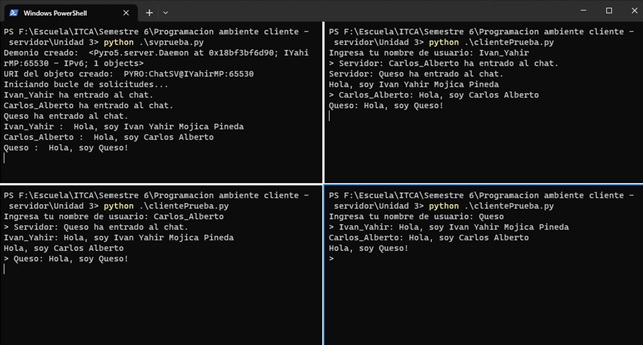

# Programación Ambiente Cliente/Servidor

# Tema 3 : Remote Method Invocation (RMI)

# Actividad 1

Como parte del desarrollo de esta actividad, se siguieron las instrucciones estipuladas en el [manual de prácticas](./Manual_PACS_V2.pdf) de la asignatura que se puede encontrar en el repositorio.

El cliente para esta parte de la actividad se puede encontrar [aquí](./ChatSimple/ClienteChat.py)
El servidor se puede encontrar [aquí](./ChatSimple/ServidorChat.py)

Para esta actividad también desarrollé un programa de chat simple, donde varios usuarios pueden interactuar con un servidor intercambiando las URI de sus objetos remotos. El resultado es este:

